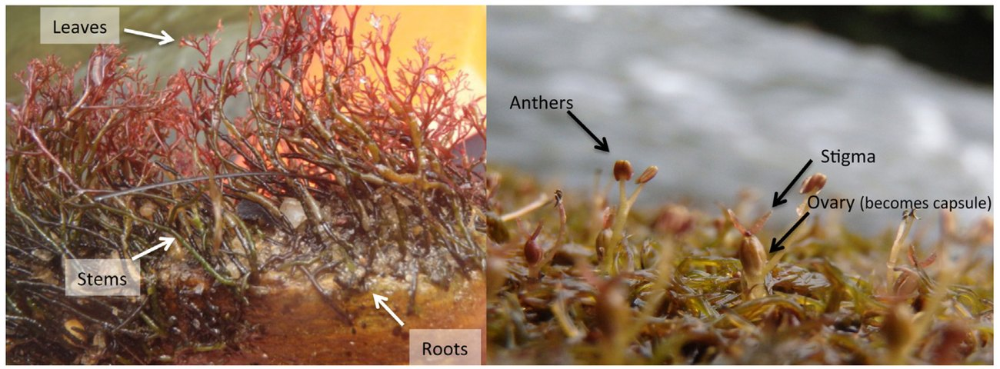
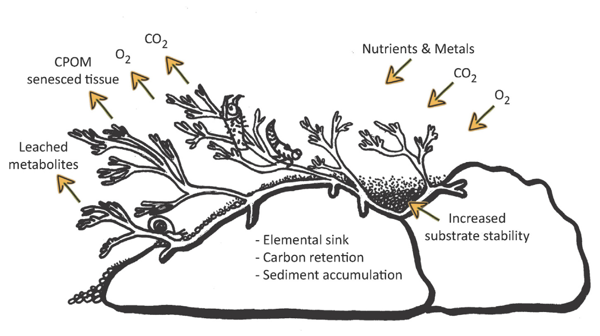
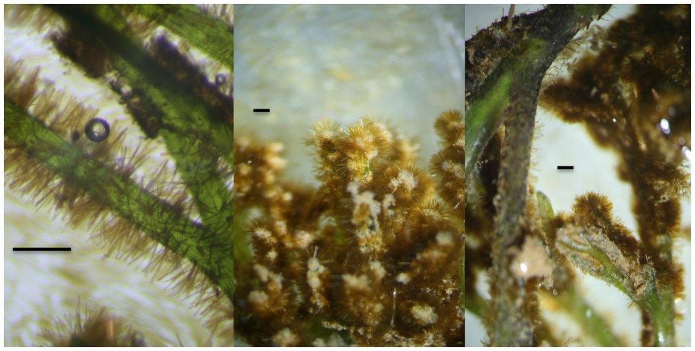
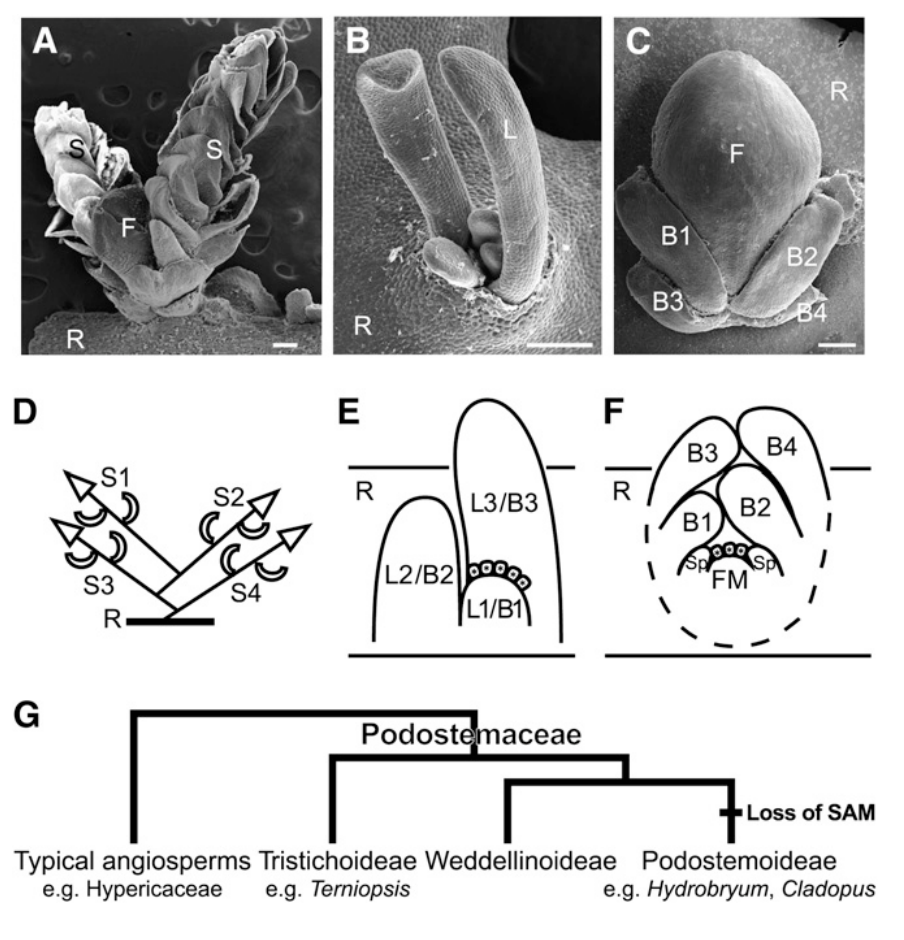
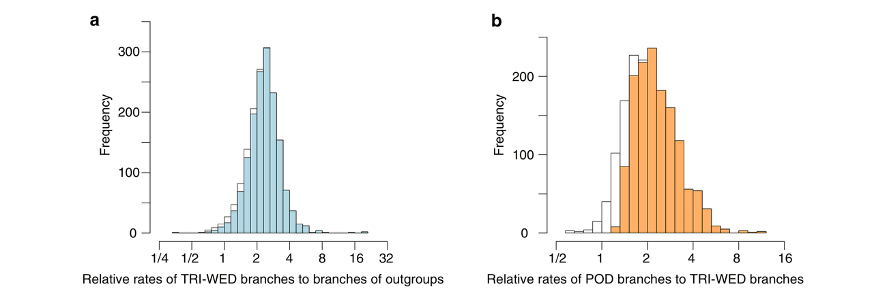
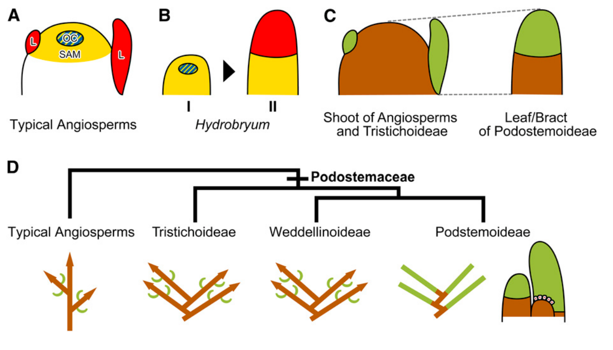
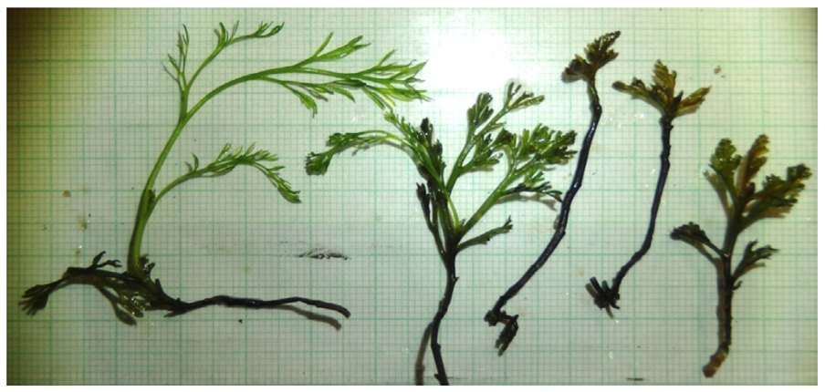
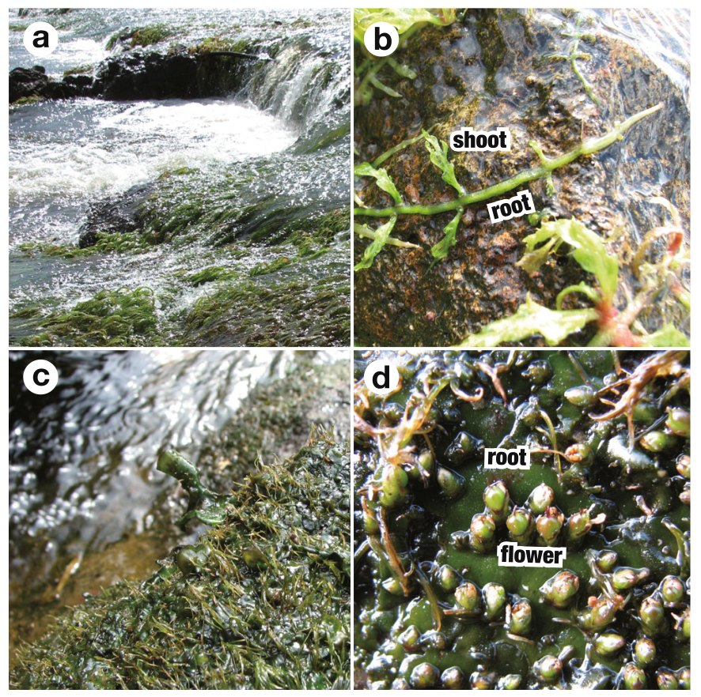
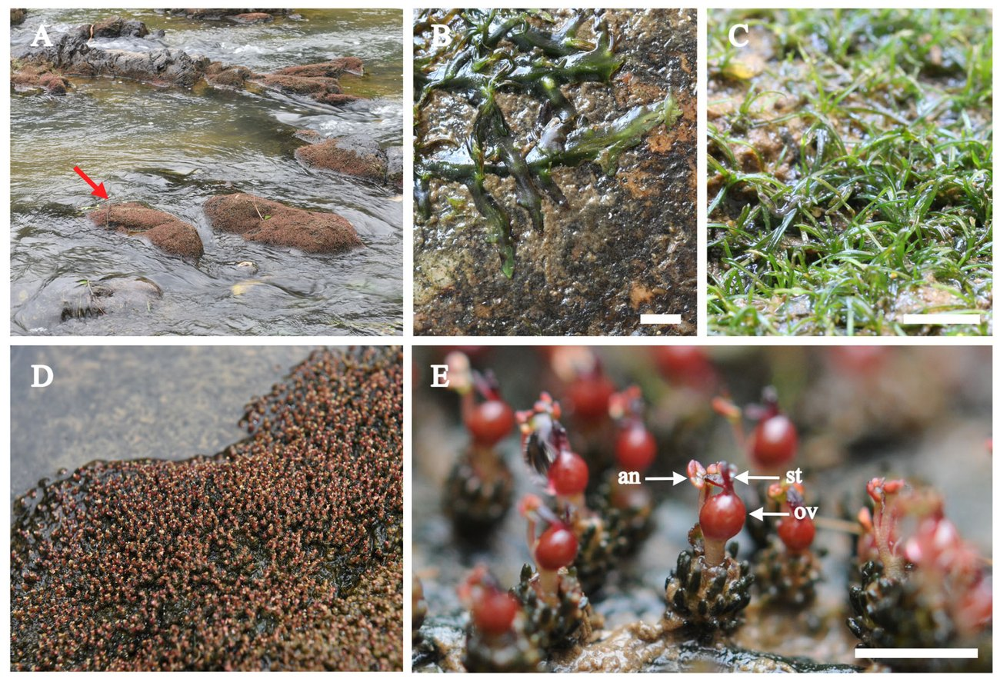

Analysis plan

Decoding Organ Identity in <i>Podostemum ceratophyllum</i>

A comparative de novo transcriptome strategy for testing “fuzzy morphology”

  
  
Wood &amp; Freeman (2017) Fig. 1a–b3 — leaves, stems and roots of <i>P. ceratophyllum</i> in a fast-flowing river

Sequencing complete
Computational plan

---

# What this deck covers

### In scope

- **Why the question matters** — the morphological puzzle and the prior molecular evidence
- **What we are testing** — three falsifiable questions about organ identity
- **The pipeline** — QC → assembly → annotation → orthology → quantification → DEG → network
- **How we read the answer** — which pattern supports which conclusion
- **Limitations** — what this design can and cannot establish

### Where we start

<b>Data in hand.</b> Nine libraries — root, “stem” and leaf, three biological replicates each. NovaSeq X Plus, PE150, <b>non-stranded</b> poly-A. Downloaded and on the HPC; the vendor QC report covers six of the nine.

<b>No nuclear genome</b> for <i>P. ceratophyllum</i>, and only one for the whole family — <i>Cladopus chinensis</i>20. Several plastomes exist15,27,28,30, but a plastome has ~76 protein-coding genes and none of the nuclear regulators we are after.

<b>Prior molecular evidence</b> is candidate-gene in situ hybridisation in three other podostemoid genera12,13 — never transcriptome-wide, and never in this species.

The reference therefore has to be <b>built</b> before the question can be asked — which is what most of this deck is about.

---

# The organism

A foundation species of eastern North American rivers3

- The **only** Podostemaceae species native to the continental U.S. and Canada — of roughly 135 in the Americas
- Dense monospecific stands in well-lit riffles; refuge and spawning habitat for benthic macroinvertebrates and fish
- Sequesters dissolved N, P, Ca and Zn; supplies organic carbon to the detrital food web
- Obligate rheophyte, clinging to bedrock through adhesive root hairs (*haptera*)

<b>Regionally imperilled.</b> Ohio: Endangered4 · New York: Threatened, S2S35 · Maryland: S36 · Pennsylvania: S4. Survival tracks <b>local</b> habitat conditions — part of why baseline genomic resources carry conservation value.

  
  
Wood &amp; Freeman (2017) Fig. 23 — interaction with the benthic environment: elemental sink, carbon retention, sediment accumulation, substrate stabilisation

---

# The classical model, and the misfits

### Classical Root–Shoot model (CRS)

The vegetative body is built from **three discrete organ classes** with sharp boundaries and determinate homology.

  
<b>Root</b>

  
<b>Stem</b>

  
<b>Leaf</b>

This framework underwrites essentially all comparative angiosperm morphology16.

### “Morphological misfits”

Podostemaceae and Lentibulariaceae deviate so far from CRS that conventional descriptive language **fails systematically**2 — not at the margins, but at the level of naming the parts.

You cannot run a comparative analysis if you cannot first say which organ you are looking at.

This is exactly the situation in which a <b>molecular</b> criterion of identity becomes necessary rather than merely interesting1,7.

---

# What is actually derived in *P. ceratophyllum*

<b>Not the roots.</b> Crustose, thalloid and foliose roots are derived features of several <b>Old World</b> Podostemoideae genera — <i>Cladopus</i>, <i>Zeylanidium</i>, <i>Hydrobryum</i>. Rutishauser et al. found <i>P. ceratophyllum</i> comparatively <b>CRS-conformant</b>10: filiform roots with a root cap, endogenous lateral roots, distinguishable stems and leaves.

<b>1 · Root-borne shoots.</b> Shoots arise endogenously <i>from the root</i>, not from a shoot apex, and Podostemoideae vegetative shoots generally lack a recognisable apical meristem with a permanent stem-cell pool10,12.

<b>2 · Dithecous leaves.</b> The leaf base bears two opposed stipule-like sheaths enclosing the next leaf or flower bud — producing a <b>non-axillary branching</b> pattern rare in angiosperms2,10.

  
  
Wood &amp; Freeman (2017) Fig. 43 — stems bearing dense <i>haptera</i>, the adhesive root hairs that hold the plant to bedrock

  

    A <b>mosaic</b>: relatively conventional roots, highly derived shoot and leaf construction. Anatomy alone cannot settle the histological homology of the parts.
  

---

# Fuzzy morphology

Arber's partial-shoot theory of the leaf, extended by Sattler and Rutishauser8,9,16: category boundaries between “stem” and “leaf” are not absolute — organs occupy a developmental continuum and may express mixed or intermediate properties.

<IdentityContinuum />

---

# Phylogenetic frame and the loss of the SAM

- Podostemaceae sit within **Malpighiales** (rosids), close to Hypericaceae / Clusiaceae11
- Three subfamilies — Tristichoideae, Weddellinoideae, **Podostemoideae**; the last is defined in part by the *spathella*, a non-vascular membrane enclosing the young flower2,11
- Tristichoideae retain a fairly typical SAM with sympodial-like branching12
- Podostemoideae, to which *P. ceratophyllum* belongs, are anatomically **SAM-less at every developmental stage** — all leaves arise repeatedly from a meristematic zone at the base of the preceding leaf12,13

The character is <b>polarised</b> along the phylogeny: whatever built the podostemoid body plan happened on the branch where the SAM was lost.

  
  
Katayama, Koi &amp; Kato (2010) Fig. 112 — (A–C) SEM of shoots; (D–F) shoot development schemes; (G) subfamily phylogeny with the loss of the SAM marked

---

# Saltational evolution and elevated mutation rates

Change severe enough to break the *Bauplan* — hence the “hopeful monsters” framing in the literature1,2.

Podostemaceae show <b>elevated nuclear substitution rates</b>14 and heavily restructured plastomes — <i>ycf1</i> and <i>ycf2</i> lost, a large <i>trnK</i>–<i>rbcL</i> inversion, one <i>ycf3</i> intron gone15,27,28,29. Deep rewiring, not gradual tuning.

<b>Analytical consequence.</b> Elevated substitution rates degrade sequence-similarity searches. This is not background colour — it directly shapes how I do orthology inference at stage 3 of the pipeline.

  
  
Katayama et al. (2022) Fig. 314 — relative substitution rates over 1640 orthogroups. (a) Tristichoideae + Weddellinoideae against outgroups; (b) Podostemoideae against Tristichoideae + Weddellinoideae. Both distributions sit well above 1.

---

# Prior molecular evidence — Katayama et al. (2010)

<b>1 · Shoot–leaf identity fusion.</b> In normal angiosperms <i>STM</i> (indeterminate, shoot) and <i>ARP</i> (determinate, leaf) are <b>strictly mutually exclusive</b> in space. In SAM-less Podostemoideae the two are <b>co-expressed</b> in the young leaf/bract primordium, later resolving into a proximal <i>STM</i> domain and a distal <i>ARP</i> domain12.

<b>2 · Reversal of the compound-leaf logic.</b> Compound leaves normally arise by <i>adding</i> KNOX1 shoot character onto a leaf ground state. Here it is inverted: the shoot apex <b>loses</b> <i>STM</i>/<i>WUS</i> and <b>acquires</b> strong <i>ARP</i>, so an entire shoot is reduced to one terminal leaf12.

<b>3 · Root-borne shoot initiation.</b> <i>STM</i> and <i>WUS</i> are ectopically expressed near root tips, far from leaf tissue12,13.

Morphological novelty does not require a novel genome — decoupling and rewiring existing master regulators in space and time is sufficient.

  
  
Katayama, Koi &amp; Kato (2010) Fig. 712 — <i>STM</i> (yellow), <i>WUS</i> (blue), <i>ARP</i> (red). (C) the leaf/bract of Podostemoideae is genetically comparable to the whole shoot of other angiosperms; (D) shoot reduction across the subfamilies

---

# Three core questions

<h3>Q1 · Homology</h3>
The three sampled portions — <b>anchoring thallus</b>, the vegetative <b>“stem”</b>, and the <b>dithecous leaf</b> — what underlying tissue homology do they show at whole-transcriptome scale?

<h3>Q2 · Boundary collapse</h3>
Do the four canonical cell-fate modules — <b>STM/WUS</b>17, <b>ARP</b>, <b>WOX5/PLT</b>18, <b>CLE41/WOX4</b>19,25 — show spatial cross-expression and regulatory boundary breakdown in this species?

<h3>Q3 · Coupling to stress</h3>
Under sustained hydrodynamic mechanical stress, is anomalous developmental-gene expression <b>co-ordinated with</b> secondary cell-wall, cell-polarity and abiotic-stress networks such as the NAC family26?

Q1 and Q2 are testable with this dataset. Q3 is exploratory.

---

# The dataset, as sequenced

Three portions of the plant, three biological replicates each. <b>All nine re-run here with one tool</b> — the vendor reported only six, and numbers from two different pipelines are not comparable.

<table class="tbl">
<thead><tr><th>Tissue</th><th>Library</th><th>Raw reads</th><th>Raw bases</th><th>Q20</th><th>Q30</th><th>GC</th><th>Dup</th></tr></thead>
<tbody>
<tr><td><b>Root</b></td><td>PR1 / PR2 / PR3</td><td>88.3 / 81.9 / 82.9 M</td><td>13.3 / 12.3 / 12.4 G</td><td>99.2 %</td><td>96.6 %</td><td>47.5 / 48.1 / 47.6</td><td>75–79 %</td></tr>
<tr><td><b>Leaf</b></td><td>PL1 / PL2 / PL3</td><td>87.1 / 79.4 / 81.3 M</td><td>13.1 / 11.9 / 12.2 G</td><td>99.3 %</td><td>96.9 %</td><td>44.4 / 45.4 / 44.6</td><td>71–78 %</td></tr>
<tr><td><b>“Stem”</b></td><td>P1 / P2 / P3</td><td>95.4 / 100.1 / 89.5 M</td><td>14.3 / 15.0 / 13.4 G</td><td>99.3 %</td><td>97.1 %</td><td><b>49.2 / 49.8 / 49.8</b></td><td><b>41–61 %</b></td></tr>
</tbody>
</table>

My six numbers reproduce the vendor's to the second decimal, so the pipeline agrees with theirs — which is what makes the three unreported rows trustworthy.

The “stem” libraries are not intermediate between the other two: higher GC than either, and roughly half the duplication rate.

  
  
Wood &amp; Freeman (2017) Fig. 33 — morphological variation within <i>P. ceratophyllum</i>, all collected the same day in close proximity. Grid squares are 1 mm. The dissection has to be robust to this much plasticity.

---

# The third portion is the one in question

All three partitions the proposal assumed are present. P1–P3 are the vegetative portion, sampled in its own right.

<b>How the project names them.</b> The thallus that attaches to the rock, called <i>“root”</i>; the vegetative portion, called <i>“stem”</i>; and the leaves. The quotation marks are not incidental — naming that middle portion is the question, not the premise.

<b>What that gives us.</b> The vascular module — <i>CLE41/44</i>, <i>PXY</i>, <i>WOX4</i>, <i>HB8</i>25 — has a tissue of its own. Whether a stem-like identity is <i>held</i> anywhere in this plant can be measured, not inferred.

<b>The contrast is symmetric.</b> Root and leaf test whether boundaries collapse; the middle portion tests whether any boundary is retained. Three groups, three pairwise contrasts, three replicates each.

<b>No published expectation to match.</b> Katayama et al. found ectopic <i>STM</i> and <i>WUS</i> near root tips and <i>STM</i>/<i>ARP</i> co-expression in the leaf12. Neither result sampled a vegetative axis, so for this portion the marker panel is a genuine prediction rather than a replication.

<b>The one thing worth pinning down.</b> Where the cut falls. In a plant whose whole interest is that organ boundaries are indistinct, the line between “stem” and thallus, and between “stem” and leaf base, is drawn under the scope by judgement. How it was drawn sets how far the identity call can be pushed.

---

# The three tissues separate before any analysis

Per-sequence GC from my own QC run. Three libraries per tissue, one line each.

<GcProfiles />

<b>“Stem” is the most distinct of the three.</b> GC <b>49.2–49.8 %</b> against leaf 44.4–45.4 and root 47.5–48.1; duplication <b>41–61 %</b> against 71–79 % in both others; plastid reads <b>0.25–0.45 %</b>, lowest of the nine. All three replicates agree. Least plastid fits the portion that photosynthesises least; least duplication means the most complex library — many distinct transcripts rather than a few dominant ones.

<b>The leaf shoulder is not plastid — tested.</b> Plastomes run <b>~35 % GC</b>28,30, so the position fit and the hypothesis was live. Re-mapping in local mode, which lets reads clip past cross-genus mismatch27,28, lifted <b>root 25–32 %</b> but <b>leaf only 2–8 %</b>. A 25–29 % shoulder would need ~25 % plastid; these libraries give <b>0.8–4.1 %</b>. The reference works — the shoulder is simply made of something else.

<b>Read with care.</b> Duplication rate and GC also track RNA input and library batch, and the replicates of one tissue were likely prepared together. Three independent measures agreeing is suggestive, but this is a hypothesis for the differential expression step to test — not a result on its own.

---

# The marker panel — four canonical modules

Reference architecture in model eudicots; the yardstick every identity call is made against

<table class="tbl">
<thead>
<tr>
<th style="width:17%">Organ system</th>
<th style="width:25%">Core modules and marker families</th>
<th>Developmental function in typical plants</th>
</tr>
</thead>
<tbody>
<tr>
<td><b>SAM</b> undifferentiated stem-cell centre</td>
<td>Class I KNOX (<i>STM</i>, <i>KNAT1/2/6</i>) · WOX (<i>WUS</i>) · CLAVATA (<i>CLV3</i>)</td>
<td><i>STM</i> is expressed across the SAM, suppressing differentiation and maintaining stem-cell identity. <i>WUS</i> is confined to the organising centre and forms the classic negative-feedback loop with <i>CLV3</i> that sets stem-cell pool size and pluripotency.17</td>
</tr>
<tr>
<td><b>Leaf primordium</b> determinate differentiation</td>
<td>MYB-domain TFs (<i>ARP</i> / <i>AS1</i> / <i>AS2</i> / <i>PHAN</i>) · YABBY · CUC</td>
<td><i>AS1</i> switches on in peripheral primordium cells and directly represses <i>STM</i> and KNOX transcription, terminating indeterminate division and conferring determinacy plus adaxial–abaxial polarity.12</td>
</tr>
<tr>
<td><b>RAM / QC</b> root stem-cell niche</td>
<td><i>WOX5</i> · GRAS (<i>SHR</i>, <i>SCR</i>) · AP2 (<i>PLT1/2</i>)</td>
<td><i>WOX5</i> marks the quiescent centre and maintains niche autonomy; it is induced by the non-cell-autonomous <i>SHR</i>/<i>SCR</i> pair and converges with PLETHORA to fix the root developmental axis.18</td>
</tr>
<tr>
<td><b>Vascular cambium</b> radial thickening</td>
<td>CLE–PXY (<i>CLE41/44</i>, <i>PXY</i>/<i>TDR</i>) · <i>WOX4</i> · <i>HB8</i></td>
<td>Phloem-derived CLE41 peptide binds the PXY receptor kinase, activating <i>WOX4</i> and <i>HB8</i> and directing periclinal division and bidirectional xylem/phloem differentiation.19,25</td>
</tr>
</tbody>
</table>

---

# Per-tissue hypotheses and targets

<table class="tbl">
<thead>
<tr>
<th style="width:13%">Sample class</th>
<th style="width:22%">Morphological hypothesis</th>
<th style="width:24%">Targeted marker set</th>
<th>Molecular test</th>
</tr>
</thead>
<tbody>
<tr>
<td><b>R · Root</b> n = 3</td>
<td>Anchoring tissue that also photosynthesises and carries ectopic shoot-forming potential</td>
<td>RAM markers: <i>WOX5</i>, <i>SHR</i>, <i>SCR</i>, PLT family Shoot initiation: <i>STM</i>, <i>WUS</i></td>
<td>Can a coherent root-cap and cortex regulatory network be recovered here? And is <i>STM</i>/<i>WUS</i> present in root tissue at all — the single most direct test of the Katayama result12.</td>
</tr>
<tr>
<td><b>L · Leaf</b> n = 3</td>
<td>Dithecous photosynthetic organ of mixed shoot–leaf identity, apical dominance lost</td>
<td>Leaf determinacy and polarity: <i>ARP</i> (<i>AS1</i>), YABBY, CUC Apical stem cells: <i>STM</i>, <i>WUS</i>, <i>CLV3</i></td>
<td>In the SAM-less state, do the stem-cell maintenance network and the terminal leaf-differentiation network show graded co-expression and overlap?17</td>
</tr>
<tr>
<td><b>S · “Stem”</b> n = 3</td>
<td>Vegetative portion between thallus and leaf; identity undetermined, which is the point of sampling it</td>
<td>Vascular set <i>CLE41/44</i>, <i>PXY</i>, <i>WOX4</i>, <i>HB8</i>25, read against all four modules</td>
<td>Is a procambial / vascular identity <i>held</i> here while it collapses elsewhere? Or does this portion also carry root and leaf markers together?</td>
</tr>
</tbody>
</table>

<b>The three rows are not symmetric in what they risk.</b> Root and leaf have published expectations to meet12; the middle portion has none, so whatever it shows is a first observation rather than a confirmation. That makes it the most informative row and the least anchored one.

---

# What each outcome would mean

Committing to the interpretation before seeing the data

<b class="text-slate-800">Modules segregate cleanly by tissue</b> R = root markers only, L = leaf markers only, minimal overlap

→

CRS holds at the molecular level. Fuzzy morphology is <b>not</b> supported for this species — a genuine and publishable negative result.

<b class="text-slate-800">Graded co-expression of opposing modules</b> KNOX1 and ARP both present in L; <i>STM</i>/<i>WUS</i> present in R

→

Molecular support for fuzzy morphology; identity is <b>continuous</b>, not categorical. This is what the prior literature predicts.

<b class="text-slate-800">Modules absent or unrecoverable</b> no confident orthologs assigned

→

Ambiguous — must separate true loss from <b>detection failure</b> under high sequence divergence. Handled explicitly at pipeline stage 3.

<b class="text-slate-800">L and R look alike</b> few DEGs between them

→

Suspect a <b>technical</b> cause first — dissection carryover or insufficient depth — before reaching for a biological one.

---

# The pipeline

Four stages from raw reads to an identity call

<PipelineFlow />

---

# Stage 1 · Quality control

### Steps

1. **FastQC** on every FASTQ, aggregated with **MultiQC** for cross-library comparison
2. **TrimGalore** (or Trimmomatic) — remove sequencing adapters and low-quality bases below **Phred Q 30**
3. **Rcorrector** — k-mer error correction; discard reads unfixable through sequencing error or low complexity
4. Re-run FastQC to confirm the trim actually improved the libraries

Following the published de novo workflows for non-model organisms22,23.

### What I am checking for

- **Per-library consistency** — one bad replicate distorts every downstream contrast
- **Duplication rate** — high duplication with low complexity suggests over-amplification
- **rRNA carry-over** — poly(A) selection is imperfect in high-polysaccharide tissue
- **GC distribution** — a bimodal GC profile is the first hint of non-plant contamination

Assembly quality caps everything downstream, and de novo assembly has no reference to catch our mistakes for us.

---

# Stage 1b · The contamination problem

<b>The QC narrowed this down.</b> The root–leaf GC gap is a <b>low-GC shoulder in the leaf</b> libraries, not extra high-GC material in the root — and that shoulder is where any foreign transcripts would show up first.

Why the risk is real here

- Submerged and epiphytised; algal overgrowth is a documented decline driver3
- The **root** fraction sits on the substrate, in direct contact with biofilm
- Algal transcripts assemble cleanly and annotate confidently as “plant”

Mitigation

- Taxonomic assignment of contig best hits
- **GC against coverage** — contaminants form a distinct cloud
- Test whether flagged contigs are **root-specific**
- Report the flagged set rather than deleting it

<b>Open question:</b> filter before or after assembly? Pre-filtering is cleaner but risks discarding genuine low-coverage plant reads.

  
  
Katayama et al. (2022) Fig. 114 — podostemads in natural populations: plants on rocks in rapids, and riverbed rock covered by foliose roots. The tissue we sequence grows in a biofilm.

---

# Stage 2 · De novo assembly with Trinity

### Approach

No reference genome exists for *P. ceratophyllum*, so the transcript reference has to be built from the reads themselves.

**Trinity (v2.x)**24 — de Bruijn graph assembly, run on **all nine libraries pooled** (root, “stem” and leaf), so that one common reference supports every comparison.

Minimum k-mer coverage threshold set permissively, so <b>low-abundance regulatory transcripts</b> are still reconstructed. Transcription factors are exactly the class we cannot afford to lose.

### Decisions to settle

<b>Pooled vs per-tissue assembly.</b> Pooling gives one coordinate system for quantification; per-tissue assembly recovers tissue-specific isoforms but complicates comparison. I favour <b>pooled</b>, with per-tissue assemblies kept as a diagnostic check only. The “stem” libraries matter most in the pool — they are the least duplicated of the nine, so they contribute the largest share of distinct transcripts.

<b>In-silico read normalisation.</b> Cuts memory and runtime substantially, at some cost to rare transcripts. Worth testing both on one tissue before committing.

<b>Assembly scale.</b> At ~40 M PE reads per library, pooling everything is a large Trinity job — memory, not CPU, is the binding constraint. In-silico read normalisation moves from optional to necessary here; I will benchmark the cost to rare transcripts on one tissue before committing.

---

# Stage 2b · Redundancy reduction and assembly QA

### CD-HIT-EST → Unigenes

Trinity output is intentionally redundant — isoform splitting, allelic polymorphism, sequencing error. Uncorrected, this **splits read support** across duplicate contigs and deflates expression estimates.

<b>Threshold trade-off.</b> 0.99 preserves close paralogs; 0.95 collapses more aggressively for a cleaner set, but risks merging recent duplicates that may have <i>diverged in function</i>. Given the paralogy risk I lean toward the conservative <b>0.99</b>, resolving duplicates later with gene trees.

<b>Alternative worth discussing.</b> Corset or Trinity SuperTranscripts group transcripts by shared read support rather than sequence identity alone — better behaved for quantification, at the cost of a less familiar output format.

### Three quality measures, read together

  
<b>BUSCO</b> against embryophyta_odb10 — complete, duplicated, fragmented, missing. High duplication would itself be informative.

  
<b>ExN50</b> — N50 restricted to the transcripts carrying the top <i>x</i>% of expression. More honest than raw N50, which long unsupported contigs inflate.

  
<b>Read representation</b> — the fraction of clean reads that map back. The most direct measure of what we have lost.

<b>A caveat on BUSCO for this family.</b> Podostemaceae carry elevated mutation rates14 and documented gene loss15, so a depressed score may reflect <b>real biology</b>. I plan to benchmark against the published <i>Cladopus chinensis</i> figures20 rather than generic plant thresholds.

---

# Stage 3a · CDS prediction and functional annotation

### CDS prediction

**TransDecoder** — identify likely coding regions and translate to peptide sequence.

Peptides, not nucleotides, are what we compare across deep divergence. Given elevated substitution rates in this family14, protein-level comparison is not a preference — it is the only level at which the signal survives.

### Functional annotation

- **BLASTX** at E-value **1e-5** against NCBI **NR** (broad homology) and **Swiss-Prot** (curated, high-confidence function)
- **Pfam** — protein domain architecture
- **GO** classification via **TopGO**; **KEGG** pathway enrichment via **KOBAS**21

Domain architecture is more robust than raw similarity for our purpose: a divergent KNOX gene may fail a similarity threshold while still carrying an unmistakable homeodomain plus KNOX-A/B signature.

---

# Stage 3b · Orthology inference

The step the whole argument depends on

### Method

**Proteinortho** — sequence similarity plus a graph-based reciprocal-best-hit criterion, to infer orthologous groups across species.

Reference proteomes

<b>Arabidopsis thaliana</b> — where the module definitions come from; all four marker networks are characterised here

<b>Populus trichocarpa</b> — woody, well-annotated cambium; the reference for the CLE41/PXY/WOX4 module25

<b>Cladopus chinensis</b>20 — the only sequenced nuclear genome in the family, and the closest available control for family-level divergence

  
  
Xue et al. (2020) Fig. 120 — <i>Cladopus chinensis</i>

### Why single best-hit BLAST is insufficient

<b>1 · Elevated divergence.</b> Podostemaceae have anomalously high nuclear substitution rates14. A true <i>STM</i> ortholog may return a weak or misleading best hit.

<b>2 · Paralogy.</b> WOX, KNOX and NAC are large families, expanded in this lineage20, and best-hit assignment cannot reliably separate <i>WUS</i> from <i>WOX4</i> from <i>WOX5</i> — but that distinction <b>is</b> the experiment.

<b>Mitigation.</b> For the marker families specifically: build a profile HMM, retrieve all family members, align, and place candidates on a <b>gene tree</b> alongside characterised references. Assign identity by tree position, not by score rank.

---

# Stage 4a · Quantification and differential expression

### RSEM / Salmon → the expression matrix

Map each library's clean reads back onto the de novo Unigene reference; compute **TPM** (or FPKM) for unbiased expression estimates across all nine samples on one scale.

Quality gates before proceeding

- **Mapping rate per library** — a low outlier flags a problem replicate
- **PCA and sample correlation heatmap** — replicates must cluster by tissue, not by batch; whether “stem” falls between L and R or apart from both is itself a result
- **Library size and normalisation factors**

<b>If replicates do not cluster by tissue, I stop here.</b> Every downstream result would be built on an unreliable grouping, and the honest response is to revisit the dissection rather than press on.

### DESeq2 — three contrasts

  
<b>Root</b> vs <b>Leaf</b> &nbsp;·&nbsp; <b>Leaf</b> vs <b>“Stem”</b> &nbsp;·&nbsp; <b>“Stem”</b> vs <b>Root</b>

Benjamini–Hochberg adjusted <i>q</i> &lt; 0.05 and |log2FoldChange| ≥ 1, with a likelihood-ratio test across all three tissues alongside the pairwise contrasts; tissue-specific up-regulated clusters then go to GO and KEGG enrichment.

<b>What DEG analysis cannot answer.</b> Pairwise DEGs answer <i>“where is this gene higher?”</i> — not <i>“what organ is this?”</i> Fuzzy morphology predicts <b>co-expression</b>: a gene at comparable levels in both root and leaf is absent from the DEG list entirely, yet is precisely the evidence for boundary collapse. Three contrasts help, but they do not fix this — it is the main reason the analysis cannot end at the DEG table.

---

# Stage 4b · Network analysis and the identity readout

### WGCNA co-expression modules

Cluster Unigenes into modules of co-varying expression, independent of any pairwise contrast — then correlate module eigengenes with tissue identity, locate the marker genes **inside** the module structure, and pull out hub genes as candidate regulatory drivers.

If the SAM module and the leaf-determinacy module have <b>fused into a single co-expression module</b>, that is a far stronger statement about network topology than any list of individually significant genes.

<b>Caveat.</b> WGCNA is designed for many samples. Nine libraries is well below the usual range, so the module structure will be coarse and must be treated as exploratory rather than as a confirmed network.

### Three converging views

<b>1 · Marker atlas.</b> Four canonical modules × root, “stem” and leaf, plotted in <b>absolute TPM</b> rather than fold change. This is the figure that answers Q2, and most likely the central figure of the paper.

<b>2 · Specificity index.</b> A per-gene τ-type tissue-specificity index across the three tissues — turning “fuzzy vs discrete” from a verbal claim into a <b>distribution</b>. Three tissues is thin for τ but workable; two would not have been.

<b>3 · Cross-species comparison.</b> Correlate each tissue's ortholog-restricted profile against published organ-specific transcriptomes21. Does the root profile resemble a conventional root, a stem, or neither?

<b>No single view is decisive on its own.</b> Where the three disagree, that disagreement is itself a result worth reporting.

---

# Interpretation

### Boundary dissolution as adaptation

To resist the shear forces of fast-flowing rivers, the plant must abandon vertical extension, a slender supporting taproot and a tall branched architecture.

  
<b>Extreme hydrodynamic shear</b>

  
↓

  
<b>Loss of topological isolation between fate networks</b>

  
↓

  
<b>Compact planar body</b>anchorage, photosynthesis and stem-cell initiation co-located

  
↓

  
<b>Fuzzy organ identity as observable outcome</b>

Heterochrony and heterotopy become the mechanism by which mechanical stability is purchased7,12.

### Stress–development cross-talk

<b>Flagged as a working hypothesis.</b> There is no direct experimental evidence for this in Podostemaceae. I present it as something the data can be interrogated for — not as a claim — and I will not pre-commit to specific gene identifiers.

NAC-family transcription factors act both in apical meristem development and CUC-mediated organ-boundary specification, and in mechanical-stress, drought and defence signalling26. Podostemaceae live permanently under mechanical stress, with alternating submergence and desiccation.

<b>What this dataset can do.</b> Test whether NAC-family and other stress-responsive TFs are differentially expressed between the putative stem and the putative root, and whether they fall into the <b>same co-expression modules</b> as the developmental markers. Module co-membership would be <i>suggestive of</i> coupling; it would not demonstrate causal recruitment.

---

# Limitations

<b>Expression is not identity.</b> Transcript abundance is evidence about developmental programme, not proof of homology. The strongest available claim is <i>consistency with</i> a fuzzy-morphology model.

<b>No spatial resolution.</b> Bulk RNA-seq averages over every cell in a sample. Apparent co-expression of <i>STM</i> and <i>ARP</i> may reflect <b>two adjacent cell populations</b> rather than one mixed-identity cell. Distinguishing these needs in situ hybridisation12,13 or single-cell methods — and the distinction is scientifically substantial.

<b>No reference genome.</b> De novo assembly cannot fully separate paralogs, cannot report gene structure, and cannot establish whether a missing gene is truly absent or merely unassembled.

<b>n = 3.</b> Adequate for large, consistent differences; underpowered for subtle effects and for robust network inference.

<b>Tissue boundaries are set by the hypothesis under test.</b> Root and leaf were separated on morphological criteria, and we then ask whether those criteria correspond to molecular categories. Not circular — but the assignment is an <b>assumption</b>, and carryover at the dissection boundary would bias toward the fuzzy result. This belongs in any write-up.

<b>One species, one condition, one time point.</b> No developmental series, so heterochrony can be inferred but not observed.

---

# Summary

1

The morphological question is genuinely undecidable by anatomy alone. A molecular criterion of organ identity is the only route forward, and prior candidate-gene work in related genera12,13 says the signal should be there.

2

Three portions were sampled, three replicates each. The middle one — the vegetative portion the project can only call <b>“stem”</b> — is where the identity question is sharpest, and it has no prior result to be checked against.

3

The two places this project can quietly fail are <b>contamination</b> at assembly and <b>ortholog misassignment</b> under elevated divergence14 and deep paralogy. Both have explicit mitigations built into the plan.

4

Pairwise DEG analysis alone would <b>systematically miss</b> the predicted signal, because the prediction is co-expression. The marker atlas, specificity index and co-expression modules are core analyses, not extras.

5

At best this shows <b>consistency with</b> fuzzy morphology — plus a ranked candidate list and a first reference transcriptome for a regionally imperilled foundation species.

---

# References — 1 to 13

1Eckardt, N. A. &amp; Baum, D. (2010) The podostemad puzzle: the evolution of unusual morphology in the Podostemaceae [In Brief]. <i>The Plant Cell</i> <b>22</b>(7): 2104.

2Rutishauser, R. (2016) Evolution of unusual morphologies in Lentibulariaceae (bladderworts and allies) and Podostemaceae (river-weeds): a pictorial report at the interface of developmental biology and morphological diversification. <i>Annals of Botany</i> <b>117</b>(5): 811–832.

3Wood, J. &amp; Freeman, M. (2017) Ecology of the macrophyte <i>Podostemum ceratophyllum</i> Michx. (Hornleaf riverweed), a widespread foundation species of eastern North American rivers. <i>Aquatic Botany</i> <b>139</b>: 65–74.

4Ohio Department of Natural Resources, Division of Natural Areas and Preserves (2024) <i>Rare Native Ohio Plants: 2024–25 Status List</i>. Columbus, OH.

5New York Natural Heritage Program (2025) <i>Podostemum ceratophyllum</i> (riverweed) Species Status Assessment [draft]. Albany, NY.

6Maryland Natural Heritage Program (2026) <i>List of Rare, Threatened, and Endangered Plants of Maryland, March 2026</i>. Maryland Department of Natural Resources, Annapolis, MD.

7Minelli, A. (2022) Two-way exchanges between animal and plant biology, with focus on evo-devo. <i>Frontiers in Ecology and Evolution</i> <b>10</b>: 1057355.

8Rutishauser, R. &amp; Isler, B. (2001) Developmental genetics and morphological evolution of flowering plants, especially bladderworts (<i>Utricularia</i>): fuzzy Arberian morphology complements classical morphology. <i>Annals of Botany</i> <b>88</b>(6): 1173–1202.

9Rutishauser, R. (2020) EvoDevo: past and future of continuum and process plant morphology. <i>Philosophies</i> <b>5</b>(4): 41.

10Rutishauser, R., Pfeifer, E., Moline, P. &amp; Philbrick, C. T. (2003) Developmental morphology of roots and shoots of <i>Podostemum ceratophyllum</i> (Podostemaceae – Podostemoideae). <i>Rhodora</i> <b>105</b>: 337–353.

11Koi, S., Kita, Y., Hirayama, Y., Rutishauser, R., Huber, K. A. &amp; Kato, M. (2012) Molecular phylogenetic analysis of Podostemaceae: implications for taxonomy of major groups. <i>Botanical Journal of the Linnean Society</i> <b>169</b>(3): 461–492.

12Katayama, N., Koi, S. &amp; Kato, M. (2010) Expression of <i>SHOOT MERISTEMLESS</i>, <i>WUSCHEL</i>, and <i>ASYMMETRIC LEAVES1</i> homologs in the shoots of Podostemaceae: implications for the evolution of novel shoot organogenesis. <i>The Plant Cell</i> <b>22</b>(7): 2131–2140.

13Koi, S. &amp; Katayama, N. (2013) Gene expression analysis of aquatic angiosperms Podostemaceae to gain insight into the evolution of their enigmatic morphology. In: De Smet, I. (ed.) <i>Plant Organogenesis</i>. Methods in Molecular Biology, vol. 959, pp. 83–95. Humana Press, Totowa, NJ.

---

# References — 14 to 30

14Katayama, N., Koi, S., Sassa, A., Kurata, T., Imaichi, R., Kato, M. &amp; Nishiyama, T. (2022) Elevated mutation rates underlie the evolution of the aquatic plant family Podostemaceae. <i>Communications Biology</i> <b>5</b>: 75.

15Bedoya, A. M., Ruhfel, B. R., Philbrick, C. T., Madriñán, S., Bove, C. P., Mesterházy, A. &amp; Olmstead, R. G. (2019) Plastid genomes of five species of riverweeds (Podostemaceae): structural organization and comparative analysis in Malpighiales. <i>Frontiers in Plant Science</i> <b>10</b>: 1035.

16Sattler, R. (2026) Articulation morphology of plants and plant evo-devo: an open morphology—empirical, dynamic, all-inclusive, and unifying. <i>Plants</i> <b>15</b>(5): 730.

17Kean-Galeno, T., Lopez-Arredondo, D. &amp; Herrera-Estrella, L. (2024) The shoot apical meristem: an evolutionary molding of higher plants. <i>International Journal of Molecular Sciences</i> <b>25</b>(3): 1519.

18Pardal, R. &amp; Heidstra, R. (2021) Root stem cell niche networks: it's complexed! Insights from <i>Arabidopsis</i>. <i>Journal of Experimental Botany</i> <b>72</b>(19): 6727–6738.

19Etchells, J. P. &amp; Turner, S. R. (2010) Orientation of vascular cell divisions in <i>Arabidopsis</i>. <i>Plant Signaling &amp; Behavior</i> <b>5</b>(6): 730–732.

20Xue, T., Zheng, X., Chen, D. et al. (2020) A high-quality genome provides insights into the new taxonomic status and genomic characteristics of <i>Cladopus chinensis</i> (Podostemaceae). <i>Horticulture Research</i> <b>7</b>: 46.

21Gao, H., Zhao, Y., Huang, L., Huang, Y., Chen, J., Zhou, H. &amp; Zhang, X. (2022) Comparative analysis of buds transcriptome and identification of two florigen gene AkFTs in <i>Amorphophallus konjac</i>. <i>Scientific Reports</i> <b>12</b>: 6782.

22Jackson, D. J., Cerveau, N. &amp; Posnien, N. (2024) De novo assembly of transcriptomes and differential gene expression analysis using short-read data from emerging model organisms – a brief guide. <i>Frontiers in Zoology</i> <b>21</b>: 17.

23Raghavan, V., Kraft, L., Mesny, F. &amp; Rigerte, L. (2022) A simple guide to de novo transcriptome assembly and annotation. <i>Briefings in Bioinformatics</i> <b>23</b>(2): bbab563.

24Grabherr, M. G. et al. (2011) Full-length transcriptome assembly from RNA-Seq data without a reference genome. <i>Nature Biotechnology</i> <b>29</b>: 644–652.

25Galibina, N. A., Moshchenskaya, Y. L., Tarelkina, T. V. et al. (2023) Identification and expression profile of CLE41/44-PXY-WOX genes in adult trees <i>Pinus sylvestris</i> L. trunk tissues during cambial activity. <i>Plants</i> <b>12</b>(4): 835.

26Nuruzzaman, M., Sharoni, A. M. &amp; Kikuchi, S. (2013) Roles of NAC transcription factors in the regulation of biotic and abiotic stress responses in plants. <i>Frontiers in Microbiology</i> <b>4</b>: 248.

27Zhang, M., Zhang, X.-H., Ge, C.-L. &amp; Chen, B.-H. (2022) <i>Terniopsis yongtaiensis</i> (Podostemaceae), a new species from South East China based on morphological and genomic data. <i>PhytoKeys</i> <b>194</b>: 105–122.

28Wu, M., Zhang, K., Yang, X., Qian, X., Li, R. &amp; Wei, J. (2022) <i>Paracladopus chiangmaiensis</i> (Podostemaceae), a new generic record for China and its complete plastid genome. <i>PhytoKeys</i> <b>195</b>: 1–13.

29Trad, R. J., Cabral, F. N., Bittrich, V., da Silva, S. R. &amp; do Amaral, M. C. E. (2021) Calophyllaceae plastomes, their structure and insights in relationships within the clusioids. <i>Scientific Reports</i> <b>11</b>: 20712.

30Yu, H., Zhang, J., Qian, Z., Lv, Y., Wang, Y. &amp; Xu, W. (2025) Characterization of the complete chloroplast genome of <i>Cladopus doianus</i> Koriba. <i>Mitochondrial DNA Part B</i> <b>10</b>(12): 1210–1215.

Figures on slides 1, 3, 5, 7, 8, 9, 11, 12 and 18 are reproduced from refs 3, 12, 14 and 20 for internal academic discussion; each is credited on the slide where it appears.

